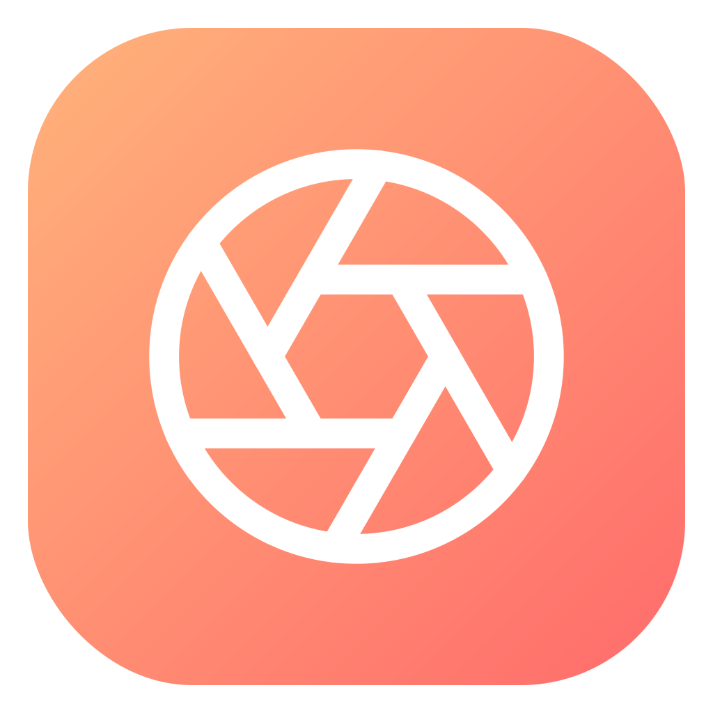

<div align="center">

<!-- TODO: replace with a rendered app logo (assets/logo/spendlens-logo-1024.png) -->


# SpendLens

**A camera-first expense diary for Vietnamese users.** Snap a receipt, add the amount and a note, then browse day/week/month summaries and charts.

Inspired by Locket's photo-forward interaction — every expense begins with a photo.

</div>

---

## Screenshots

<!-- TODO: replace these with real screenshots (suggest 1080×2280 or scaled 320px width for GitHub). Store under docs/screenshots/. -->

<table>
  <tr>
    <td align="center"><br /><sub>Camera (index) — snap a receipt, tap the lower half of the viewfinder to add a quick note.</sub></td>
    <td align="center"><br /><sub>Swipe up on the camera to see today's transactions as full-screen Locket-style cards.</sub></td>
    <td align="center"><br /><sub>Nhập chi tiết — amount, category, note.</sub></td>
  </tr>
  <tr>
    <td align="center"><br /><sub>Tổng quan — balance card, monthly budget bar, expense bar chart, category donut.</sub></td>
    <td align="center"><br /><sub>Thu chi — day-grouped feed with income/expense/net summary.</sub></td>
    <td align="center"><br /><sub>Thư viện — every receipt in a photo grid.</sub></td>
  </tr>
  <tr>
    <td align="center"><br /><sub>Chi tiết giao dịch — full photo, edit, delete.</sub></td>
    <td align="center"><br /><sub>Cài đặt — budget, reminder, theme, CSV export, reset.</sub></td>
    <td align="center"><br /><sub>Manual theme override — Auto / Light / Dark.</sub></td>
  </tr>
</table>

## Features

- **Camera-first capture.** Opens straight into the camera. Tap the lower half of the viewfinder to type a note; the note is carried through to the entry screen.
- **Locket-style paging.** Swipe up on the camera to reveal today's transactions as full-screen cards; tap any card for full details.
- **Vietnamese localization + VND formatting.** All UI copy in Vietnamese; amounts formatted as `45.000₫`, income/expense signed with `+` / `−` (U+2212).
- **Monthly budget with progress bar.** Set a budget in Settings; Home shows spent-to-date with color thresholds (coral < 80%, orange 80–100%, red > 100%).
- **Daily reminder notifications.** Local notification via `expo-notifications` with a user-picked time, idempotently rescheduled on startup.
- **CSV export.** Share transactions with a UTF-8 BOM and Vietnamese category labels — Excel opens diacritics correctly. Range picker from Settings or History.
- **Two-tier data reset.** "Delete transactions" clears only txns + photos; "Factory reset" also clears settings and cancels the reminder.
- **Theme override.** Auto (follow system) / Light / Dark, applied instantly across every screen.
- **SQLite persistence.** All transactions and settings live in `expo-sqlite`; data survives reinstalls until the user resets.
- **Muted shutter.** No click sound when capturing.

## Screens

Routing follows a camera-first `Stack` in `src/app/`:

| Route | Purpose |
|---|---|
| `/` (`index.tsx`) | **Camera**. Launch screen. Hidden note input on the viewfinder's lower half; swipe up for today's transaction cards; shutter mutes native camera sound. |
| `/entry` | **Nhập chi tiết**. Amount, Chi/Thu toggle, category chips, note, save. Doubles as the edit screen when passed an `id`. |
| `/home` | **Tổng quan**. Ngày/Tuần/Tháng segmented, gradient balance card, monthly-budget progress bar, monthly expense bar chart, category donut. |
| `/history` | **Thu chi**. Ranged summary + day-grouped feed. Share icon in header opens CSV export. |
| `/gallery` | **Thư viện**. Three-column photo grid. |
| `/transaction/[id]` | **Chi tiết giao dịch**. Full photo header, edit + delete actions. |
| `/settings` | **Cài đặt**. Monthly budget, daily reminder, theme, CSV export, resets, About. |

## Tech stack

- **[Expo SDK 57](https://docs.expo.dev/versions/v57.0.0/)** — `expo-router`, `expo-camera`, `expo-sqlite`, `expo-notifications`, `expo-file-system`, `expo-sharing`, `expo-image`, `expo-linear-gradient`, `expo-splash-screen`, `expo-status-bar`, `expo-constants`.
- **React Native + TypeScript strict.**
- **[NativeWind v5 / Tailwind CSS v4](https://www.nativewind.dev/)** available (utility classes) alongside the custom `sl/*` primitives.
- **[Plus Jakarta Sans](https://fonts.google.com/specimen/Plus+Jakarta+Sans)** via `@expo-google-fonts/plus-jakarta-sans`.
- **[react-native-svg](https://github.com/software-mansion/react-native-svg)** — icons, donut, bar chart, gradient fills.
- **[Jest](https://jestjs.io/) + [`jest-expo`](https://docs.expo.dev/develop/unit-testing/) + [@testing-library/react-native](https://callstack.github.io/react-native-testing-library/) v14.**
- **[EAS Build](https://docs.expo.dev/build/introduction/)** — `preview` profile produces `.apk`, `production` profile produces `.aab`.

## Project structure

```
src/
├── app/                          # expo-router file-based routes
│   ├── _layout.tsx               # SafeAreaProvider → SettingsProvider → TransactionsProvider → ThemedShell
│   ├── index.tsx                 # Camera + Locket-style paging FlatList
│   ├── entry.tsx                 # Add/edit a transaction
│   ├── home.tsx                  # Dashboard with budget bar, bar chart, donut
│   ├── history.tsx               # Day-grouped feed
│   ├── gallery.tsx               # Photo grid
│   ├── settings.tsx              # Settings screen
│   └── transaction/[id].tsx      # Detail + delete
│
├── components/
│   ├── sl/                       # SpendLens design primitives (Text, BudgetBar, DateRangeModal, DonutChart, BarChart, TxnCard, TodayBadge, Icons, ...)
│   └── expense/                  # Category icons, toast
│
├── lib/
│   ├── db.ts                     # expo-sqlite schema + createDb()
│   ├── transactions.ts           # Typed Txn + sync CRUD + aggregations
│   ├── transactions-context.tsx  # TransactionsProvider + useTransactions()
│   ├── settings.ts               # Typed settings CRUD over key/value table
│   ├── settings-context.tsx      # SettingsProvider + useSettings()
│   ├── notifications.ts          # Daily reminder schedule/cancel
│   ├── export.ts                 # CSV builder + share
│   ├── seed.ts                   # First-launch sample data
│   ├── categories.ts             # Vietnamese category labels
│   └── format.ts                 # formatVND, signedVND, compactK/Tr, dayLabel
│
└── constants/
    └── tokens.ts                 # Design tokens (AccentGradient, Money, SLColors, W, Radius, useColors)

assets/
├── logo/                         # SpendLens logo (SVG + 512 + 1024 PNG)
└── images/                       # Splash + template assets

docs/
├── superpowers/
│   ├── specs/                    # Design specs (dated)
│   └── plans/                    # TDD implementation plans (dated)
└── screenshots/                  # README screenshots (TODO)
```

## Getting started

**Requirements:** Node 20+, npm, and either Expo Go on a physical device OR the Android/iOS simulator. Camera and SQLite are native modules, so **the web target is not supported**.

```bash
# 1. Install dependencies
npm install

# 2. Start Metro
npx expo start

# 3. Then press:
#    i — iOS simulator
#    a — Android emulator
#    or scan the QR with Expo Go
```

On first launch the SQLite database is seeded with a small sample of transactions so every screen has realistic data immediately.

### Reset the local database

Two options in-app under **Settings → Data**:

- **Xoá giao dịch** — clears transactions + local receipt photos only.
- **Reset về mặc định** — also clears settings (budget, reminder, theme) and cancels the scheduled reminder.

## Testing

```bash
# Unit tests (Jest + jest-expo)
npm test

# Type-check
npx tsc --noEmit
```

Suite covers:

- `format.test.ts` — formatVND, signedVND, compactK/Tr, dayLabel, date-key helpers.
- `categories.test.ts` — categoryOf lookup + Vietnamese labels.
- `db.test.ts` — SQLite schema init.
- `transactions.test.ts` — resetTransactions clears rows + swallows local-file delete errors.
- `settings.test.ts` — round-trip load/update/reset for every key type.
- `notifications.test.ts` — schedule cancels-then-schedules with fixed identifier.
- `export.test.ts` — CSV BOM, escape triggers, income/expense labelling.
- `budget-bar.test.tsx` — three threshold states + CTA when unset.
- `txn-card.test.tsx` — badge, category label, expense/income signs, tap navigation.
- `sanity.test.ts` — smoke check the harness.

## Build (EAS)

**Prerequisites:** an Expo account. First-time on a device: `npx eas login`.

```bash
# Android APK (internal distribution — direct-install on device)
npx eas build --platform android --profile preview

# Android AAB for Play Store submission
npx eas build --platform android --profile production

# iOS (requires Apple Developer account)
npx eas build --platform ios --profile production
```

Build profiles live in [`eas.json`](./eas.json). Icons and splash configured in [`app.json`](./app.json) point at `assets/logo/spendlens-logo-1024.png`.

## Architecture highlights

- **Camera-first Stack.** `src/app/_layout.tsx` renders a bare `Stack` (no tab bar). The camera is the launch screen; every other screen is pushed onto it.
- **Sync SQLite.** All DB access uses `execSync` / `getAllSync` / `getFirstSync` / `runSync` — consistent, no context switches, no async plumbing.
- **Provider hierarchy.** `SafeAreaProvider` → `SettingsProvider` → `TransactionsProvider` → `ThemedShell`. `ThemedShell` reads `useSettings()` to resolve the effective theme (`auto | light | dark`) and passes both `getColors(effective)` and `DarkTheme/DefaultTheme` down. This lets Auto follow system while Light/Dark override.
- **Locket-style paging.** The camera screen is a vertical `FlatList` with `pagingEnabled` and `snapToInterval={SCREEN_HEIGHT}`. Page 0 is the camera; pages 1..N are today's transactions rendered as `TxnCard`. Only today shows here — a design choice that keeps the peek-experience narrow; the full history is at `/history`.
- **Hidden note input on camera.** A `Pressable` covers the lower half of the viewfinder. Tap → focus a `TextInput` above the keyboard (`KeyboardAvoidingView`). The FlatList's `scrollEnabled` toggles on `noteFocused` so the two gestures don't fight.
- **`sl/*` design primitives.** All screens compose from `Text`, `GradientButton`, `Shutter`, `Segmented`, `CategoryChip`, `TransactionRow`, `BarChart`, `Donut`, `PhotoTile`, `BudgetBar`, `TxnCard`, `TodayBadge`, `DateRangeModal`. Tokens live in `src/constants/tokens.ts`.

## Roadmap

- [ ] Google Sign-In (`users` table already scaffolded in `db.ts`)
- [ ] Cloud sync
- [ ] Standalone Stats screen with year-over-year comparison
- [ ] iOS build
- [ ] Note field UI on Entry (currently the GHI CHÚ input is shown as one visible field; a separate "camera note" preview may follow)

## Design docs

Every non-trivial change goes through spec → plan → implementation. Docs live in:

- `docs/superpowers/specs/` — approved design docs, dated.
- `docs/superpowers/plans/` — 8–16-task TDD implementation plans matching each spec.

## License

MIT © [bluez44](https://github.com/bluez44)

<!-- TODO: add a LICENSE file at repo root if you want the badge to render on GitHub. -->
